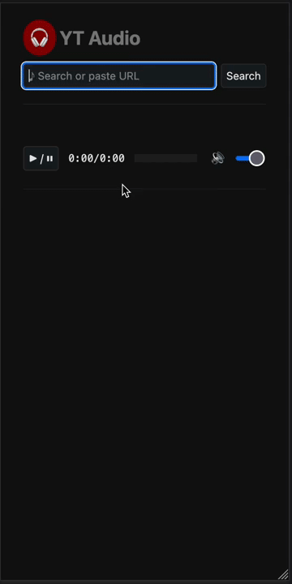

# 🎧 YT Audio

Personal music searching and streaming app.

**Features** search and play from Bandcamp, Soundcloud, YouTube or URL
- **Ranking** of search results (title similarity, provider quality and duration)
- **Playlist** support
- **No app**, full browser UI.



## Installation

YT Audio uses an API wrapped around [`yt-dlp`](https://github.com/yt-dlp/yt-dlp). You need to run the server-side API before you can use the front-end UI in the browser.

1. **Clone** the code

    ```sh
    git clone https://github.com/damiencorpataux/yt-dlp-audio-api.git
    cd yt-dlp-audio-api
    ```

2. **Run the API** (in Docker or baremetal on your system)

    in **Docker**
    ```sh
    docker compose up --build
    ```

    or **baremetal** on your system
    ```sh
    pip install -r requirements
    cd ytaudio
    uvicorn app:app --host 0.0.0.0 --reload
    ```

    > ℹ️ The API is made to run on your local computer or server.
    >
    > ⚠️ Be careful to **not expose the API to the public** because requests to music providers are made from your IP address.
    >
    > You can enable API authentication by setting `PROFILE=secure` environment variable ([read the code](ytaudio/app.py)).

3. **Search & play music**

    Visit http://localhost:8000 if you installed YT Audio on your local computer
    or use the IP/hostname of the server you installed it on.

## Documentation

API Routes: http://localhost:8000/docs